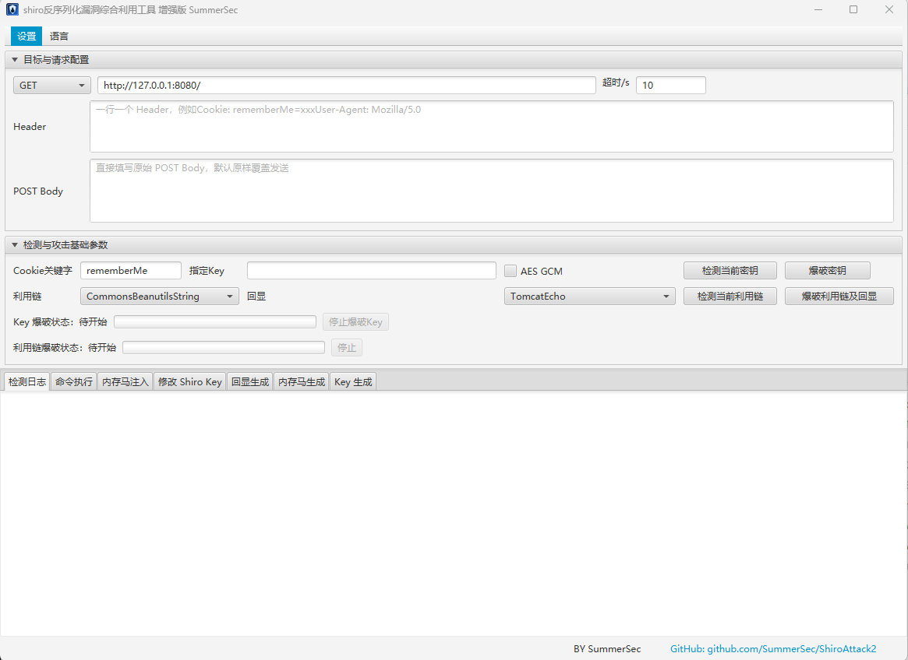

# 

<h1 align="center" >ShiroAttack2</h1>
<h3 align="center" >一款针对Shiro550漏洞进行快速漏洞利用</h3>
 <p align="center">
    <a href="https://github.com/SummerSec/ShiroAttack2"></a>
    <a href="https://github.com/SummerSec/ShiroAttack2"></a>
    <a href="https://github.com/SummerSec/ShiroAttack2"></a>
     <a href="https://github.com/SummerSec/ShiroAttack2"></a>
  <a href="https://github.com/SummerSec/ShiroAttack2"></a>
     <a href="https://github.com/SummerSec"></a>
     <a href="https://github.com/SummerSec"></a>
	<a href="https://twitter.com/SecSummers"></a>
	<a xmlns="http://www.w3.org/2000/svg" xmlns:xlink="http://www.w3.org/1999/xlink" xlink:href="https://visitor-badge.laobi.icu"><rect fill="rgba(0,0,0,0)" height="20" width="49.6"/></a>
	<a xmlns="http://www.w3.org/2000/svg" xmlns:xlink="http://www.w3.org/1999/xlink" xlink:href="https://visitor-badge.laobi.icu"><rect fill="rgba(0,0,0,0)" height="20" width="17.0" x="49.6"/></a>
	</p>


## 前言

关于该工具更新内容介绍后续会更新到博客下面**https://shiro.sumsec.me/**

> 语言切换 / Language：**[中文](./README.md)** | [English](./README_EN.md)

完整使用说明：[docs/USAGE.md](./docs/USAGE.md)

## 工具特点

* JavaFX GUI，开箱即用
* 处理没有第三方依赖的情况
* 支持多版本 CommonsBeanutils gadget（1.8.3 / 1.9.2 / AttrCompare）
* 支持内存马注入（Filter / Servlet 型，支持哥斯拉、蚁剑、冰蝎、NeoreGeorg、reGeorg）
* 采用直接回显执行命令（Tomcat / Spring / DFS-AllEcho）
* 支持修改 rememberMe 关键词
* 支持直接爆破利用 gadget 和 key
* 支持代理（HTTP/HTTPS，支持认证）
* 支持修改 Shiro Key（内存马方式，**可能导致业务异常**）
* 添加 DFS 算法回显（AllEcho）
* 支持自定义请求头，格式：`abc:123&&&test:123`
* 支持 POST 型 Shiro 探测与利用
* Key 生成器（随机生成 AES Key）

## 最新功能

### 修改 Shiro Key（增强版）

通过内存马方式动态替换目标服务器的 Shiro rememberMe AES Key，注入后自动验证新旧 Key 状态：

| 变体 | 说明 |
|------|------|
| filterConfigs -> shiroFilterFactoryBean | 标准 Spring 注入路径（推荐首选） |
| getFilterRegistration -> shiroFilterFactoryBean | 备选注入路径 |
| filterConfigs -> 常见 Shiro 名依次匹配 | 自动匹配常见 Shiro Filter 名称 |
| getFilterRegistration -> 常见 Shiro 名依次匹配 | 同上，备选路径 |
| filterConfigs -> 包含 shiro 的名称扫描 | 模糊扫描包含 shiro 字符串的 Filter |
| **高风险**: 全候选 rememberMeManager 扫描 | 多节点/多 rememberMeManager 场景 |

支持历史 Key 记录（最多保存 30 条），注入后自动验证新 Key 可用性与旧 Key 失效状态。

### Echo Generator（jEG 模块）

基于 [java-echo-generator](https://github.com/c0ny1/java-echo-generator)（`jeg-core`）的回显 Payload 生成器：

* 选择来源：`Legacy`（原有链路）或 `jEG`（第三方生成器）
* 支持服务端类型、执行模型、输出格式自由组合
* 生成失败时自动回退到 Legacy 逻辑

### Memshell Generator（jMG 模块）

基于 [java-memshell-generator](https://github.com/pen4uin/java-memshell-generator)（`jmg-sdk`）的内存马生成器：

* 选择来源：`Legacy`（原有链路）或 `jMG`（第三方生成器）
* 支持工具：哥斯拉、蚁剑、冰蝎、NeoreGeorg、reGeorg
* 支持服务端：Tomcat、Spring MVC
* 支持 Shell 类型：Filter、Servlet、Interceptor、HandlerMethod、TomcatValve
* 生成失败时自动回退到 Legacy 逻辑

### 依赖安装（本地 Maven 仓库）

在项目构建前，请先安装以下第三方 Jar 到本地 Maven：

```bash
mvn install:install-file -Dfile=jEG-Core-1.0.0.jar -DgroupId=jeg -DartifactId=jeg-core -Dversion=1.0.0 -Dpackaging=jar
mvn install:install-file -Dfile=jmg-sdk-1.0.9.jar -DgroupId=jmg -DartifactId=jmg-sdk -Dversion=1.0.9 -Dpackaging=jar
```

更多接入细节：[docs/THIRD_PARTY_GENERATORS.md](./docs/THIRD_PARTY_GENERATORS.md)

## 文档

| 文档 | 说明 |
|------|------|
| [docs/USAGE.md](./docs/USAGE.md) | 完整功能使用说明 |
| [docs/FAQ.md](./docs/FAQ.md) | 常见问题 |
| [docs/memshell.md](./docs/memshell.md) | 内存马说明 |
| [docs/BypassWaf.md](./docs/BypassWaf.md) | WAF 绕过 |
| [docs/NoGadget.md](./docs/NoGadget.md) | 无 Gadget 场景 |
| [docs/THIRD_PARTY_GENERATORS.md](./docs/THIRD_PARTY_GENERATORS.md) | jEG/jMG 集成说明 |

## 使用方法

当前 Release 默认同时提供两类产物：

- `shiro_attack-<version>-<jdk>.jar`：单文件可执行版本
- `shiro_attack-<version>-<jdk>-bundle.zip`：包含运行所需目录的完整压缩包

推荐优先下载 `bundle.zip`，解压后直接运行，目录结构更完整。

**目录结构准备：**

```text
./
├── shiro_attack-{version}-{jdk}.jar
├── data/
│   └── shiro_keys.txt   # Shiro Key 字典，每行一个 Base64 Key
└── lib/                 # CommonsBeanutils 各版本 JAR
```



如果你下载的是 `bundle.zip`：

- 解压后即可获得 `jar + data + lib` 的完整目录结构
- 默认更适合直接运行与分发

如果你下载的是单独 `jar`：

- 仍需自行准备 `data/shiro_keys.txt`
- `lib/` 目录中需包含 CommonsBeanutils 相关依赖

运行方式：

```bash
java -jar shiro_attack-<version>-<jdk>.jar
```

其中：

- `data/shiro_keys.txt`：Shiro Key 字典，每行一个 Base64 编码的 Key
- `lib/`：CommonsBeanutils 各版本依赖

GitHub Release 由 Actions 自动构建并上传 jar 与 zip 产物；推送 tag（如 `5.0.1`）后会自动生成 Release。**版本说明**可维护在 [`docs/releases/`](./docs/releases/) 下与 tag 同名的 `*.md` 文件中，并会出现在对应 GitHub Release 正文顶部。


详细使用说明见 [docs/USAGE.md](./docs/USAGE.md)


---

## :b:免责声明

该工具仅用于安全自查检测

由于传播、利用此工具所提供的信息而造成的任何直接或者间接的后果及损失，均由使用者本人负责，作者不为此承担任何责任。

本人拥有对此工具的修改和解释权。未经网络安全部门及相关部门允许，不得善自使用本工具进行任何攻击活动，不得以任何方式将其用于商业目的。

该工具只授权于企业内部进行问题排查，请勿用于非法用途，请遵守网络安全法，否则后果作者概不负责

----


